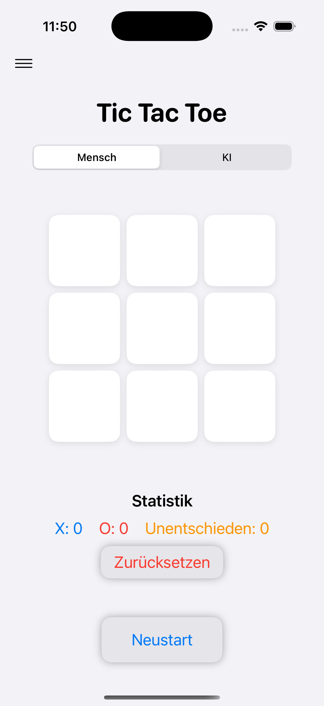
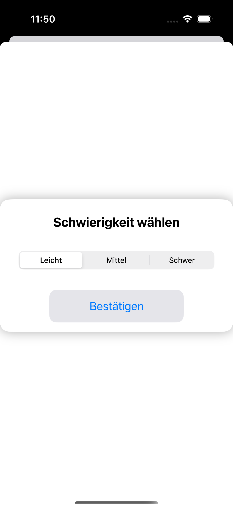
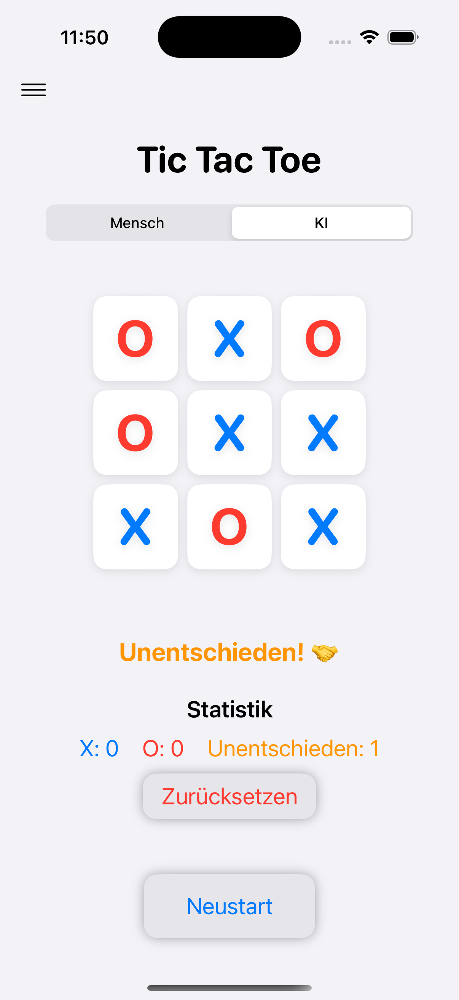
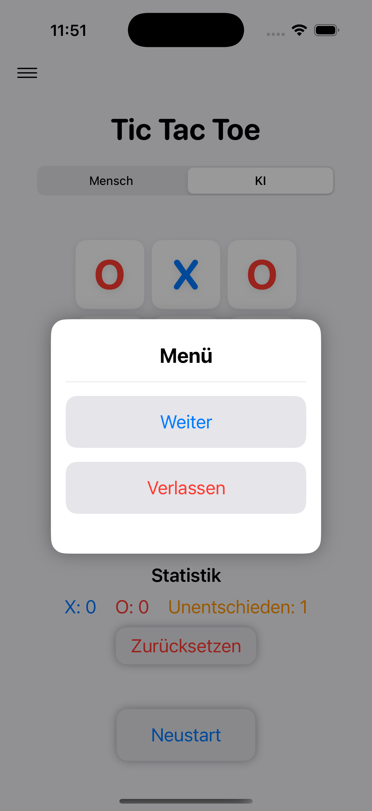

# TicTacToe-Erjon

Ein Tic Tac Toe Spiel für iOS, iPadOS und macOS.

## Funktionen

- Spiel gegen eine KI mit drei wählbaren Schwierigkeitsstufen (leicht, mittel, schwer)
- Optimiert für iPhone, iPad und Mac
- KI trifft Entscheidungen je nach Schwierigkeitsgrad (von zufällig bis logisch)
- Erkennung von Unentschieden und Siegen mit visuellem Feedback
- Popup-Menü mit Optionen zum Fortsetzen oder Verlassen des Spiels
- Der Spielmodus kann während des Spiels nicht mehr geändert werden

## Technologien

- SwiftUI
- MVVM-Architektur
- Eigene Entscheidungslogik für die KI
- Unit-Tests und UI-Tests mit XCTest

## Screenshot

  
  
  
  

## Projektübersicht

Alle Dateien befinden sich im Hauptordner des Projekts:

| Datei | Beschreibung |
|-------|--------------|
| `ContentView.swift` | Hauptansicht mit Spielfeld |
| `DifficultySelectionView.swift` | Ansicht zur Auswahl der Schwierigkeit |
| `GameLogic.swift` | Spiellogik und KI-Entscheidungen |
| `TicTacToeApp.swift` | Einstiegspunkt der App |
| `Assets.xcassets` | App-Icons und Farbschema |
| `TicTacToeTests.swift` | Unit-Tests für Spiellogik |
| `TicTacToeUITests.swift` | UI-Tests zur Oberfläche |
| `TicTacToeUITestsLaunchTests.swift` | Testlauf-Konfiguration |

## Nutzung

1. Projekt in Xcode öffnen
2. Mit `⌘B` (Command + B) das Projekt bauen
3. Auf einem Simulator oder echten Gerät ausführen
