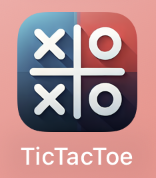

# TicTacToe-Erjon

Ein Tic Tac Toe Spiel für iOS, iPadOS und macOS.

## Funktionen

- KI mit drei wählbaren Schwierigkeitsstufen (leicht, mittel, schwer)
- Optimiert für iPhone, iPad und Mac
- KI trifft Entscheidungen je nach Schwierigkeitsgrad (von zufällig bis logisch)
- Erkennung von Unentschieden und Siegen mit visuellem Feedback
- Popup-Menü mit Optionen zum Fortsetzen oder Verlassen des Spiels
- Haptisches Feedback

## Technologien

- SwiftUI
- MVVM-Architektur
- Eigene Entscheidungslogik für die KI
- Unit-Tests und UI-Tests mit XCTest

## Screenshot

  
  
  
  

## Projektübersicht

Alle Dateien befinden sich im Hauptordner des Projekts:

| Datei | Beschreibung |
|-------|--------------|
| `ContentView.swift` | Hauptansicht mit Spielfeld |
| `DifficultySelectionView.swift` | Ansicht zur Auswahl der Schwierigkeit |
| `GameLogic.swift` | Spiellogik und KI-Entscheidungen |
| `TicTacToeApp.swift` | Einstiegspunkt der App |
| `Assets.xcassets` | App-Icons und Farbschema |
| `TicTacToeTests.swift` | Unit-Tests für Spiellogik |
| `TicTacToeUITests.swift` | UI-Tests zur Oberfläche |
| `TicTacToeUITestsLaunchTests.swift` | Testlauf-Konfiguration |

## Nutzung

1. Projekt in Xcode öffnen
2. Mit (Command + B) das Projekt bauen
3. Auf einem Simulator oder echten Gerät ausführen

# Selbstreflexion

Während der Entwicklung meines TicTacToe-Spiels in Swift hatte ich einige Probleme. In dieser Selbstreflexion beschreibe ich, wie ich sie gelöst habe.

## Problem 1: Struktur und Planung

Am Anfang wusste ich nicht genau, wie ich das Projekt strukturieren soll. Es gab viele Teile: die Spiellogik, die Benutzeroberfläche, die KI und die Möglichkeit, gegen einen Menschen oder gegen die KI zu spielen. Damit ich nicht den Überblick verliere, habe ich das Projekt in Abschnitte aufgeteilt. So konnte ich die Probleme, auf die ich gestossen bin, schneller finden und besser lösen.

## Problem 2: Quadratisches Spielfeld auf allen Geräten

Mit der Darstellung des Spielfelds hatte ich die meisten Schwierigkeiten. Ich wollte, dass es auf iPhone, iPad und Mac immer gleich aussieht. Also ein quadratisches Spielfeld, zentriert und ohne Verzerrung. Dabei bin ich ständig auf neue Fehler gestossen. Mal war das Feld zu breit, mal zu schmal oder nicht zentriert. Es war besonders schwierig, ein Layout zu finden, das auf allen Bildschirmgrössen gleich gut funktioniert.

Durch den Einsatz von `GeometryReader` konnte ich dieses Hindernis überwinden. Damit konnte ich die Grösse des sichtbaren Bereichs abfragen. Ich habe dann die kleinere Seite als Grundlage genommen, um daraus ein Quadrat zu berechnen. So konnte ich sicherstellen, dass das Spielfeld auf allen Geräten gleichmässig dargestellt wird. Durch das Anpassen der Zellengrössen und der Abstände ist am Ende ein sauberes, mittiges Spielfeld entstanden, das auf jedem Gerät zuverlässig funktioniert.

## Problem 3: Künstliche Intelligenz mit drei Schwierigkeitsstufen

Ich wollte eine KI einbauen, die in drei Schwierigkeitsstufen spielbar ist: leicht, mittel und schwer. Jede Stufe sollte sich spürbar anders verhalten. Das umzusetzen war nicht einfach, weil jede Variante eigene Entscheidungen treffen muss. In der leichten Stufe trifft die KI zufällige Entscheidungen, in der mittleren nutzt sie einfache Strategien, und in der schweren spielt sie fast optimal.

Das Problem, auf das ich gestossen bin, war die schwerste Stufe. Ich wollte sie schwierig machen, aber gleichzeitig sollte sie schnell reagieren. Am Anfang hat sie zu lange überlegt und brauchte viel Zeit, bis sie ihren Spielzug gemacht hat. Ich habe viel ausprobiert und getestet, bis ich eine gute Balance zwischen Spielstärke und Reaktionszeit gefunden habe.

## Fazit

Ich fand dieses Projekt sehr spannend, und ich habe auch viel in meiner Freizeit daran gearbeitet, weil es mir Spass gemacht hat, etwas Eigenes zu erstellen. Ich habe gelernt, dass man viele Probleme erst beim Testen auf verschiedenen Geräten erkennt. Auch wenn es oft komplizierter war als gedacht, konnte ich am Ende ein funktionierendes und vollständiges Spiel umsetzen.

Ich bin stolz auf das Ergebnis und werde sicher weitere Spiele programmieren. Am meisten freue ich mich darüber, wenn ich mein fertiges Produkt anderen zeigen kann. Zum Beispiel meinen Eltern oder Freunden.
